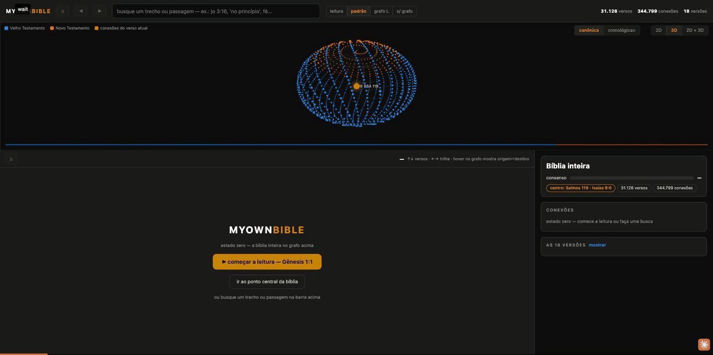

<h1 align="center">myownbible</h1>

<div align="center">
  
  
  
  
  
</div>
<br/>

<div align="center"><strong>Um grafo de conhecimento navegável da Bíblia — leia o texto vendo exatamente
onde cada trecho se conecta com o resto do cânon.</strong></div>
<div align="center">Viewer/companion do dataset público <a href="https://github.com/damarals/biblias">damarals/biblias</a>
(18 traduções em português) + 344.799 referências cruzadas da
<a href="https://www.openbible.info/labs/cross-references/">OpenBible.info</a> (CC-BY).</div>
<br/>



## O que ele faz

- **Texto único por eleição (SOT)** — para cada um dos 31.126 versículos, as 18
  traduções são comparadas e vence a redação *medoid* (a mais próxima de todas).
  Nada é gerado: cada verso é cópia literal de UMA tradução, com origem, score
  de consenso e ausências rastreáveis (os "pontos exclusivos", ex.: Atos 8:37).
- **Grafo navegável** — arco 2D estilo *chord* dos 1.189 capítulos + ego-rede 3D
  do verso atual (órbita interna = matches exatos, externa = matches de sentido).
  Hover mostra origem⇄destino; clique navega.
- **Duas linhas do tempo** — ordem canônica ou cronológica≈ (Jó primeiro,
  profetas intercalados com Reis, cartas do NT por composição).
- **Busca dupla** — autocomplete por referência (`jo 3:16`, `sl 23`) e texto
  (FTS5), ou 🎯 *busca ao centro do grafo*: a query vira o nó central com camadas
  separadas de **frase exata** vs **sentido** (embeddings locais).
- **Leitor em crawl** com breadcrumb de saltos (back volta ao verso onde você
  parou), notas pessoais por capítulo/verso, 4 layouts (leitura · padrão ·
  grafo L · sem grafo).
- **Curiosidade calculada do grafo**: o capítulo mais conectado da Bíblia é
  Salmos 119 (3.940 conexões) e o verso mais conectado é Isaías 9:6 (238).


## Rodar

```bash
# 1. dados (não distribuídos neste repo — vêm do dataset público do damarals)
git clone https://github.com/damarals/biblias
curl -L -o data/cross-references.zip https://a.openbible.info/data/cross-references.zip
mkdir -p data && unzip -o data/cross-references.zip -d data/

# 2. construir o banco (~30s, determinístico)
BIBLIAS_CANONICAL=../biblias/data/canonical python3 scripts/build_db.py

# 3. servir (stdlib puro, zero pip install)
python3 server.py            # → http://127.0.0.1:8341
```

### Busca semântica (opcional)

Aponte para **qualquer endpoint OpenAI-compatível de embeddings** — Ollama,
LM Studio, llama.cpp, OpenAI — e indexe os 31k versos (retomável):

```bash
export MOB_EMBED_URL=http://localhost:11434/v1/embeddings   # ex.: Ollama
export MOB_EMBED_MODEL=nomic-embed-text
python3 scripts/embed_index.py
```

A busca entende numerais por extenso ("as 10 pragas" → "dez pragas") e cai para
a vizinhança semântica quando não há match literal.

## Arquitetura

```
data/bible.db           SQLite (WAL): verses, sot, sot_fts (FTS5), crossrefs,
                        chapter_edges, vectors        [gitignored — build local]
data/notes.db           suas notas (separado: sobrevive a rebuilds)
scripts/build_db.py     pipeline determinístico: alinhamento por (livro, cap, verso),
                        consenso medoid por Jaccard de tokens, OSIS→USFM
scripts/embed_index.py  indexação de embeddings em lote, retomável
server.py               API http.server (stdlib): /api/meta /search /chapter
                        /verse /query_center /semantic /notes
web/index.html          UI completa num arquivo: canvas 2D/3D, crawl, HUD — zero deps
```

Nenhum framework, nenhum bundler, nenhum `npm install` — o app inteiro é
Python stdlib + um HTML.

## Créditos e licenças

| Componente | Fonte | Licença |
|---|---|---|
| Código deste repo | — | MIT |
| Textos bíblicos | [damarals/biblias](https://github.com/damarals/biblias) (Daniel Amaral) | das editoras; domínio público onde marcado † |
| Referências cruzadas | [OpenBible.info](https://www.openbible.info/labs/cross-references/) (Treasury of Scripture Knowledge + votos) | CC-BY |
| Embeddings (setup padrão) | Qwen3-Embedding-8B local | Apache 2.0 |

> **Aviso**: este repositório **não distribui** texto bíblico — o banco é
> construído localmente a partir do dataset público acima. Várias traduções
> pertencem às suas editoras; o consolidado SOT é para **uso pessoal de
> estudo**. Para redistribuir texto, restrinja às traduções de domínio público.

## Notas para quem fizer fork

- **Nenhum dado acompanha este repo** — `data/` é gerado localmente por você a
  partir das fontes públicas acima. Não reivindicamos direito algum sobre os
  textos: este projeto apenas **reorganiza a leitura** de fontes já publicadas.
- **O RAG é 100% reproduzível**: qualquer endpoint OpenAI-compatível de
  embeddings serve (`MOB_EMBED_URL`/`MOB_EMBED_MODEL`); a indexação é retomável
  e a busca semântica é brute-force em numpy — sem serviço externo, sem custo.
- O pipeline inteiro é determinístico: apague `data/bible.db` e reconstrua
  quando quiser; suas notas ficam em `data/notes.db` (ou no localStorage do
  navegador, no demo) e há botões de **backup/restore** em JSON no painel Notas.
- Para trocar o dataset (outra língua, outras traduções), basta apontar
  `BIBLIAS_CANONICAL` para uma pasta com o mesmo formato JSON por livro.
